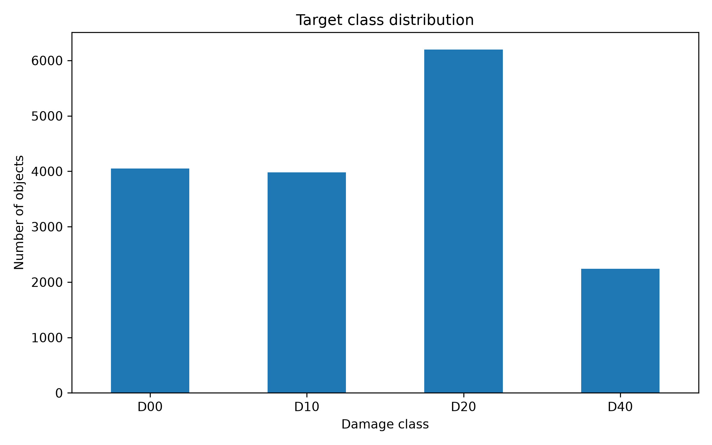
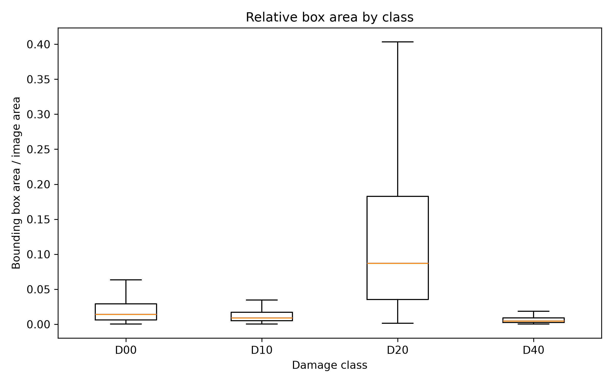
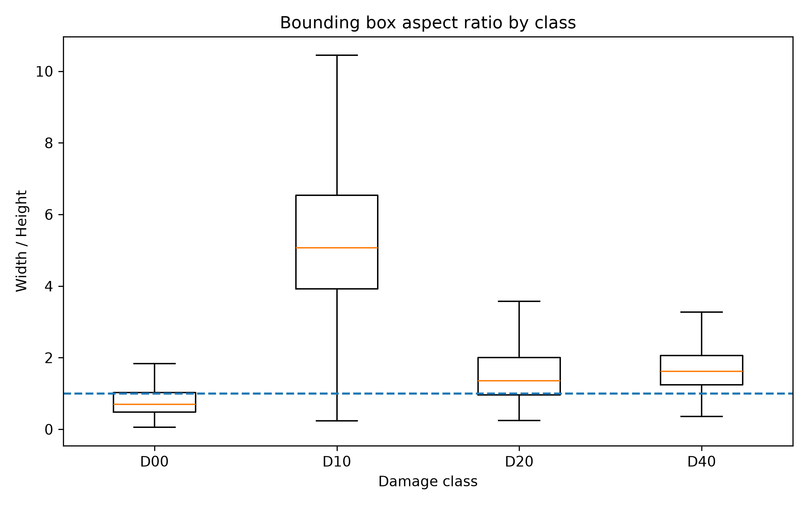
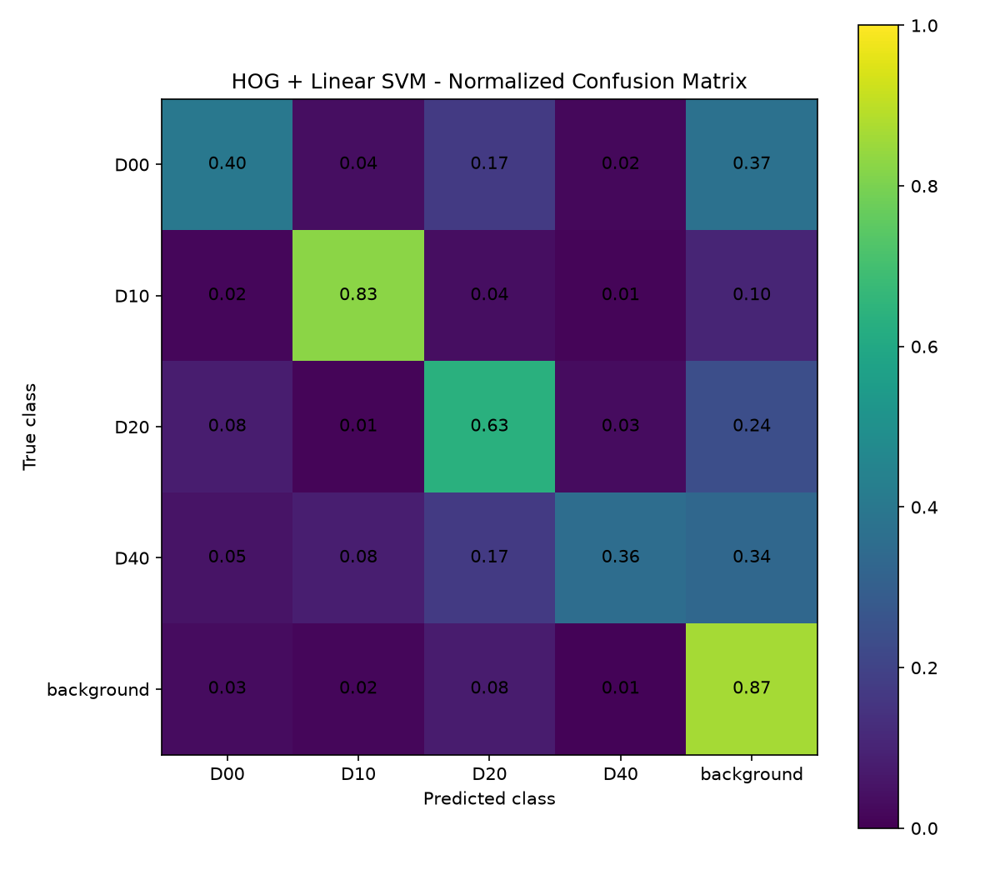
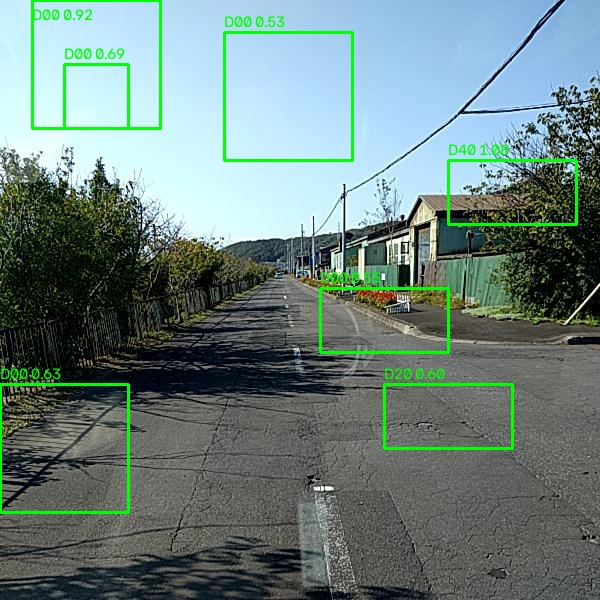
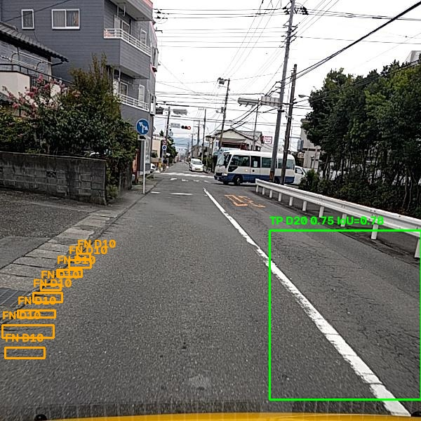
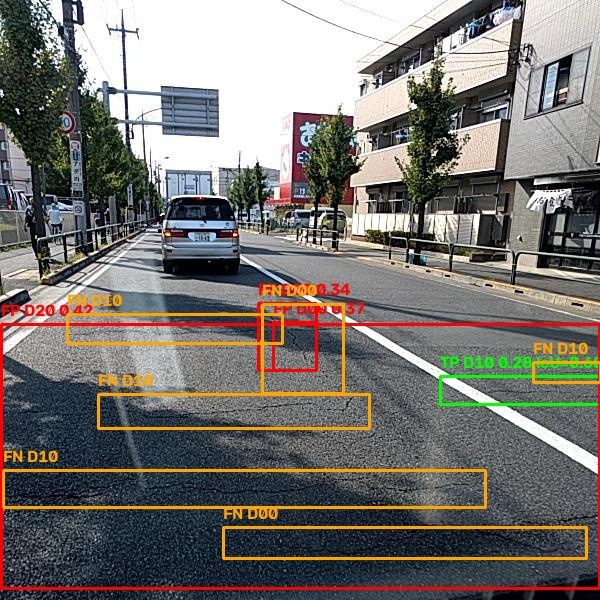
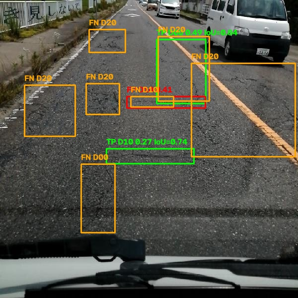
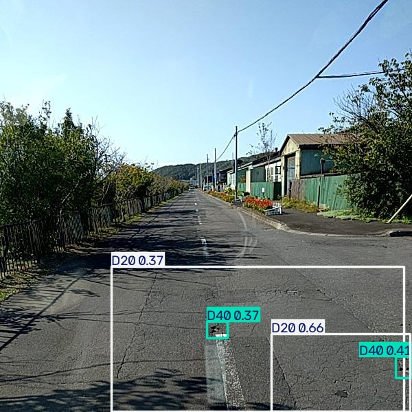

# RoadVision

RoadVision is a Computer Vision project for the automatic detection of road damage from images.

The project compares a classical Computer Vision approach based on **HOG features and a Linear SVM** with a Deep Learning approach based on a **pre-trained YOLO11s model fine-tuned on road damage data**.

The objective is to detect four types of road damage:

- **D00** - Longitudinal Crack
- **D10** - Transverse Crack
- **D20** - Alligator Crack
- **D40** - Pothole

---

## 1. Dataset

The project uses the **Japan subset of the Road Damage Dataset 2022 (RDD2022)**.

The original annotations are provided in Pascal VOC XML format.

Only the following four classes are used:

| Class | Description        |
| ----- | ------------------ |
| D00   | Longitudinal Crack |
| D10   | Transverse Crack   |
| D20   | Alligator Crack    |
| D40   | Pothole            |

The annotated images were divided into:

- **70% training**
- **15% validation**
- **15% test**

A fixed split is stored in:

```text
data/processed/japan_split.csv
```

The raw dataset is not included in the repository.

---

## 2. Project Pipeline

The project follows this Computer Vision pipeline:

```text
RDD2022 images and XML annotations
            |
            v
    Dataset preprocessing
            |
            v
       Dataset analysis
            |
      +-----+-----+
      |           |
      v           v
 HOG + SVM      YOLO11s
 Classical      Deep Learning
      |           |
      v           v
Sliding Window  Fine-tuning
   + NMS        + Augmentation
      |           |
      +-----+-----+
            |
            v
        Evaluation
            |
            v
       Failure Analysis
            |
            v
        Image Demo
```

---

## 3. Data Preprocessing

The preprocessing stage performs the following operations:

1. Read the Pascal VOC XML annotations.
2. Check the bounding-box coordinates.
3. Keep only the four target classes.
4. Create a fixed train/validation/test split.
5. Convert Pascal VOC bounding boxes to YOLO format.

The main preprocessing scripts are:

```text
src/preprocessing/
├── pascal_voc.py
├── build_dataset_index.py
├── create_split.py
├── yolo_format.py
└── prepare_yolo_dataset.py
```

---

## 4. Dataset Analysis

A simple exploratory analysis is performed before training.

The analysis focuses on:

- class distribution;
- relative bounding-box area;
- bounding-box aspect ratio.

The generated figures are stored in:

```text
results/figures/
```

### Class Distribution



### Bounding-Box Area



### Aspect Ratio



---

## 5. Classical Approach - HOG + Linear SVM

The classical baseline uses the pipeline:

```text
Image patches
    |
    v
HOG feature extraction
    |
    v
Linear SVM
    |
    v
Damage class / Background
```

Positive samples are obtained from the ground-truth bounding boxes.

Negative samples are random crops taken from images that contain no target road damage.

Each patch is resized to a fixed size before extracting its HOG descriptor.

The classifier predicts one of five classes:

```text
D00
D10
D20
D40
Background
```

### Validation Results

The HOG + Linear SVM classifier obtained:

| Metric            | Result |
| ----------------- | -----: |
| Accuracy          | 0.7259 |
| Macro F1-score    | 0.6382 |
| Weighted F1-score | 0.7148 |

Per-class F1-score:

| Class      | F1-score |
| ---------- | -------: |
| D00        |   0.4683 |
| D10        |   0.8254 |
| D20        |   0.6271 |
| D40        |   0.4521 |
| Background |   0.8182 |

The normalized confusion matrix is available below.



---

## 6. Classical Object Detection

To apply the classifier to a complete road image, a **sliding-window detector** is used.

For each window:

1. the image patch is extracted;
2. HOG features are calculated;
3. the SVM predicts the class;
4. background predictions are discarded;
5. Non-Maximum Suppression (NMS) removes overlapping detections.

Example:



The example shows one of the main limitations of the classical approach.

Although HOG + SVM performs reasonably well when classifying isolated patches, the sliding-window detector produces several false positives on complete images.

Textures, shadows, vegetation and other edges can generate gradient patterns similar to road damage.

This motivates the use of a Deep Learning detector.

---

## 7. Deep Learning Approach - YOLO11s

The Deep Learning model is based on **YOLO11s**.

A pre-trained model is used and then fine-tuned on the four RoadVision classes.

Two main experiments were performed.

### Experiment 1 - Baseline

The first experiment uses YOLO11s with an input resolution of 640 pixels and without additional data augmentation.

Validation results:

| Precision | Recall | mAP@0.5 | mAP@0.5:0.95 |
| --------: | -----: | ------: | -----------: |
|     0.407 |  0.420 |   0.368 |        0.152 |

### Experiment 2 - Data Augmentation

The second experiment keeps the same YOLO11s model and image resolution but introduces simple data augmentation on the training set.

The transformations include:

- horizontal flipping;
- small translations;
- small scale variations;
- HSV colour variations.

Validation results:

| Precision | Recall | mAP@0.5 | mAP@0.5:0.95 |
| --------: | -----: | ------: | -----------: |
|     0.546 |  0.495 |   0.507 |        0.232 |

The augmented model achieved better validation performance and was therefore selected as the final model.

---

## 8. Final Test Results

After selecting the final model using the validation set, it was evaluated on the held-out test set.

| Precision | Recall | mAP@0.5 | mAP@0.5:0.95 |
| --------: | -----: | ------: | -----------: |
|     0.538 |  0.488 |   0.490 |        0.219 |

The final results are close to the validation results, indicating that the model maintains similar performance on unseen images.

---

## 9. Failure Analysis

The final model still presents some errors.

### Missed D10 Cracks



Some thin transverse cracks are not detected when they are small or have low visual contrast.

### False Positive



Some road textures, shadows or markings can be confused with road damage.

### Multiple Damages



Images containing several damages with different sizes and appearances are more difficult and may contain both correct detections and missed objects.

---

## 10. Demo

A simple image demo is included in:

```text
demo/detect_image.py
```

The script:

1. loads the final YOLO model;
2. reads an image using OpenCV;
3. performs object detection;
4. draws bounding boxes, classes and confidence scores;
5. saves the annotated image.

Example output:



---

## 11. Installation

The project was developed with Python 3.12.

Create a virtual environment:

```bash
python -m venv .venv
```

Activate it on Windows:

```bash
.venv\Scripts\activate
```

Install the required libraries:

```bash
python -m pip install -r requirements.txt
```

---

## 12. Dataset Setup

The RDD2022 Japan dataset must be placed in:

```text
data/raw/RDD2022/Japan/
```

The training images are expected in:

```text
data/raw/RDD2022/Japan/train/images/
```

and the XML annotations in:

```text
data/raw/RDD2022/Japan/train/annotations/xmls/
```

The raw dataset is excluded from Git.

---

## 13. Running the Preprocessing

Build the dataset indexes:

```bash
python -m src.preprocessing.build_dataset_index
```

A fixed split is already provided in:

```text
data/processed/japan_split.csv
```

Prepare the dataset in YOLO format:

```bash
python -m src.preprocessing.prepare_yolo_dataset
```

Run the dataset analysis:

```bash
python -m src.analysis.dataset_eda
```

---

## 14. Training the Classical Model

Build the HOG training dataset:

```bash
python -m src.classical.build_hog_dataset --split train
```

Build the HOG validation dataset:

```bash
python -m src.classical.build_hog_dataset --split validation
```

Train and evaluate the Linear SVM:

```bash
python -m src.classical.train_svm
```

To run the sliding-window detector:

```bash
python -m src.classical.sliding_window_detector --image path/to/image.jpg
```

---

## 15. Training YOLO

Train the baseline model:

```bash
python -m src.deep.train_yolo --experiment baseline
```

Train the model with data augmentation:

```bash
python -m src.deep.train_yolo --experiment augmented
```

The final trained model is stored in:

```text
models/yolo/best.pt
```

---

## 16. Final Evaluation

The final YOLO model can be evaluated with:

```bash
python -m src.evaluation.evaluate_test
```

The evaluation uses the held-out test split.

---

## 17. Running the Demo

Run:

```bash
python demo/detect_image.py --image path/to/image.jpg
```

The annotated image is saved inside:

```text
results/demo/
```

---

## 18. Repository Structure

```text
roadvision/
├── README.md
├── requirements.txt
├── data/
│   └── processed/
│       └── japan_split.csv
├── demo/
│   └── detect_image.py
├── models/
│   ├── classical/
│   │   └── hog_linear_svm.joblib
│   └── yolo/
│       └── best.pt
├── results/
│   ├── classical/
│   ├── demo/
│   ├── figures/
│   └── yolo/
├── src/
│   ├── analysis/
│   ├── classical/
│   ├── deep/
│   ├── evaluation/
│   └── preprocessing/
└── report/
```

---

## 19. Ethical Considerations

Road damage detection systems should not be evaluated only on model accuracy.

Images collected from roads may contain people, vehicles and licence plates, which can introduce privacy concerns.

The model can also perform differently under different road conditions, lighting, weather, pavement types or geographic areas.

For this reason, results obtained on the RDD2022 Japan subset should not automatically be assumed to generalize to every country or road environment.

---

## 20. Conclusion

RoadVision compares a traditional Computer Vision pipeline with a modern Deep Learning detector.

The HOG + SVM approach provides a useful classical baseline and demonstrates the limitations of handcrafted features and sliding-window detection on complex road scenes.

Fine-tuning YOLO11s significantly improves detection performance, especially after introducing data augmentation.

The project demonstrates the complete Computer Vision workflow from dataset preparation and feature representation to model training, evaluation, failure analysis and inference on new images.
